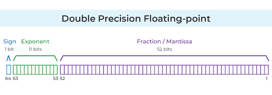

# LC-CS-172 Topics for Fri 12-Sep-2025

## Fresh Assignment

* cf. ../../assignments/solo/s3/ -- details below

## Administrivia

* add/drop is today by 4PM

* please mark your attendence in Google Classroom

* English idioms I [mis]use

    - cf.	-- conferatur			-- compare [with] (refer to)
	- e.g. 	-- exempli gratia 		-- for example
	- i.e. 	-- id est		 		-- that is (in other words)
	- N.B.	-- note bene			-- note well (hey, this is important)
	- FYI	-- for your information	-- noteworthy, but not note bene worthy

## Post-it Note Protocol

We're doing it today -- grab a red and green Post-it Note -- you should
know what to do (refer to note-02).

## Google Classroom Submissions

[[This has been superseded; see note-04.mk]]

We need to fix the submission logistics; e.g., calling it pgm.py.txt is
a disgusting hack I can't abide.

We're getting closer -- we have had submissions that simply "work",
which is our goal -- we're working on the recipe so we can reliably
reproduce it.

* what worked well: submit the pgm.py file so it becomes a Google Doc,
contents shown as [highlighted] ASCII; file has the right name (pgm.py),
we can open directly in Google Classroom, and we can attach comments to
a specific place in the file.

## Python specific data type info

- char vs. byte

- str vs. int

- quotes: ", """, ', '''

- fun w/ integers  
  new [and improved?] arbitrary precision

- fun w/ floating point  
  `double` is Python standard  
  `float` is commonly used  
  `numpy` supports both

demo

	demo_floating_point.py

## Biology Experiments

demo

    demo_quotes.py
demo

    demo_str_vs_int.py

## Types revisited

		Object	|	Binary		| 	Octal	| 	Decimal	| 	Hexidecimal
		--------|---------------|-----------|-----------|---------------
		int   5	|	0b00000101	|	005		|	 5		|	0x05		
		char '5'|	0b00110101	|	065		|	53		|	0x35
demo

    demo_integer_literals.py

## Objects and References

		vocabulary  | meaning/understanding
		------------|---------------------------------------------------
		Type		| how to interpret and operate on a bunch of bits
		Object 		| type and value	
		Reference	| memory address pointing to an object

### example

* pi_approx = 3

	pi_approx -> [0..011] as bits

	3 == 0b0011 == 0x3

* pi_value =~ 3.1416

	pi_value -> [...] as bits

    

    [figure reference](https://www.lorric.com/en/Articles/flowmeter-technology/flowmeter-technology/floating-point)

		[Google Gemini says] The 64-bit IEEE floating-point representation of 3.1416 is
		0100 0000 0001 1001 0000 1011 0011 0110 1011 0011 0110  1011 0011 0100 0000
		(or 40092B36B36B3400 in hexadecimal).

* pi_digit = [3,1,4,1,6]

    [[storage layout]]

* pi_chars = ['3','1','4','1','6']

    [[storage layout]]

## Python dynamic polymorphism

* reference points to an object, any object

* value of reference can change  
  so type of object can change

## basic simple sorts

* insertion sort

* selection sort

* bubble sort

  bubble sort is an *anti-pattern* -- don't do it!

    An [anti-pattern](https://en.wikipedia.org/wiki/Anti-pattern) is a
    solution to a class of problem which may be commonly used but is
    likely to be ineffective or counterproductive.

## Homework #3 (aka `assignment`)

* Implement a simple selection sort using only basic Python.  
  Note that selection sort is **not** *stable*.

## []
