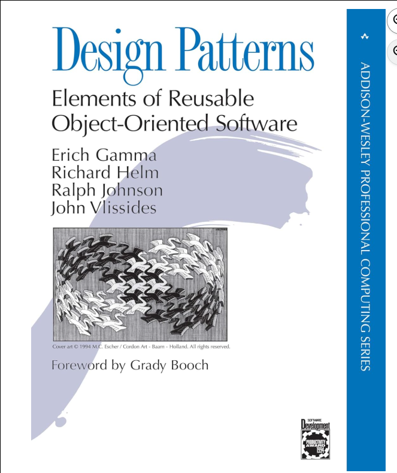

# LC-CS-172 Topics for Wed 12-Nov-2025

## Today's Hot Topics

* midterm-2b addendum -- was *optional* -- with limited upside
* why use objects
* visitor pattern (details)
* ---- we got this far today ----
* iterators (simple Python example)
* pair programming w/ BST 

## administrivia

* please mark your attendance in Google Classroom for today
  [didn't happen -- attendence assignment was not posted today]

* FYI: assignment #9 due date *is pushed out* to Mon 17-Nov-2025
  - promised 2 hours in-class (120 minutes)
  - 2 sessions so far -- ~70 minutes in-class remaining 

## why use objects

* Encapsulation and Modularity
* Practical Model
* Realistic Model
* Intuitive Model
* Data Hiding and Flexibility
* Extensibility (Abstract Data Type)
* Composable

## Data Structures are Key

	> Show me your flowcharts and conceal your tables,
	> and I shall continue to be mystified.
	> Show me your tables, and I won't usually need your flowcharts;
	> they'll be obvious.
	>
	> > -- Fred Brooks, The Mythical Man-Month

## visitor pattern (details)

* `visit` method on collection
* `visitor` function to operate on each element
* examples
  - print values in order
  - find average of items
  - verify BST integrity

#### Issues w/ find-the-average visitor

* needs [global] storage
* needs many related functions (setup/accept/output)
* names are independent, related by convention
* pollutes global namespace

#### Solution: Encapsulate -- Use an Object!

* avoid *global **variables***  -- state unique to each object
* related names of `storage` and `functions` are all together
* avoids namespace pollution -- access items through object

#### how to *return* info from a visitor

* global variables (UGH!)
* use objects (Yay!)
* use a closure (Ooh!)

[demo_visitor_using_state.py](demo_visitor_using_state.py)

# `***--->>> we got this far today <<<---***`

#### references for Design Patterns

Design Patterns: Elements of Reusable Object-Oriented Software 1st Edition by
Erich Gamma (Author), Richard Helm (Author), Ralph Johnson (Author), John
Vlissides (Author), Grady Booch (Foreword)



A Pattern Language: Towns, Buildings, Construction (Center for Environmental
Structure Series) by Christopher Alexander (Author), Sara Ishikawa (Author),
Murray Silverstein (Author), Max Jacobson (Author), Ingrid Fiksdahl-King
(Author), Shlomo Angel (Author)


## iterators

### BIG IDEA: function w/ state to return next item

### simple Python example

* Consider our simple linked list
* Uses fascinating new feature -- **yield**

	```
    def __iter__(self):
        ## defined as a generator function
        here = self.head;
        while (here != None):
            yield here
            here = here.next
	```

[demo_linked_list_iter.py](demo_linked_list_iter.py)

# `***--->>> yield to in-class programming <<<---***`

### Python details

  - re: functions (aka routine, method)
    - wo/ state (pure)
	- w/ state  (better to use method on object, object holds state)
     
    - deterministic
    - non-deterministic ('random')

* uses **lazy** evaluation

  - saves space
  - may save time too

* iterABLE

  - provides an iterATOR

* iterable and iterator as *class*

  * `__iter__`	(iterable)
  * `__next__`	(iterator)
  * iter(iterable) returns iterator

* generator *function*

  - created when function itself includes `yield`

* list comprehension

  - syntax - NB: introducing *new* feature -- `if condition`

	`expression for item in ITERABLE if condition`
    
  - uses square bracket notation [...]

* generator expression

  - like list comprehension,  
    but elements one-at-a-time
  - uses paren notation (...)

* demo

  - [demo_iterator.py](demo_iterator.py)
  - TBD: [live-coding -- countdown iterator as object](demo_countdown_object.py)
  - [demo_linked_list_iter.py](demo_linked_list_iter.py)
  - [demo_linked_list_iter_test.py](demo_linked_list_iter_test.py)

## Pair Programming w/ BST

* work on CS-172 pair programming assignment #9

#### []
