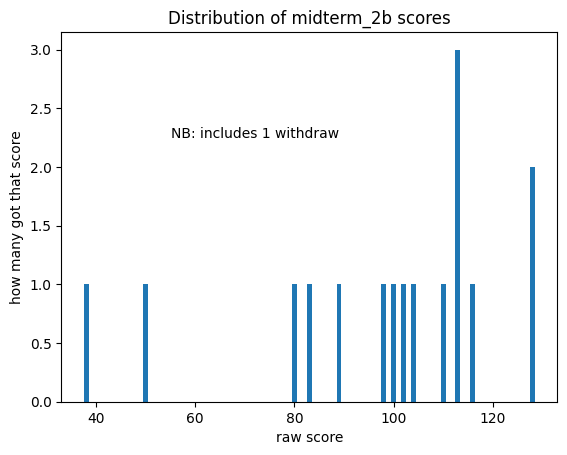
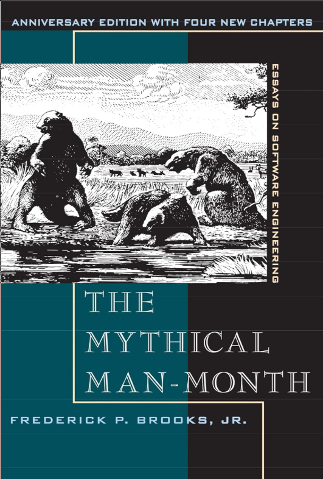
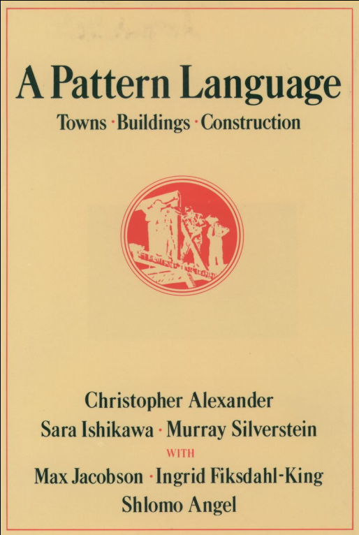

# LC-CS-172 Topics for Fri 14-Nov-2025

## Today's Hot Topics

* midterm-2b w/ addendum
* You need to know
* returning a value from a visit
* references
* #9 BST related details
* iterators (simple Python example)
* pair programming w/ BST 

## administrivia

* please mark your attendance in Google Classroom for today

* FYI: assignment #9 due date *is pushed out* to Mon 17-Nov-2025
  - pair programming -- expect 30 min today, 30 on Monday

## midterm-2b w/ addendum



## You need to know

### Python details and quirks

* there are **class** *attributes* and **object** *attributes*
  - recall a class defines a Type  
    an object is an instance of a Type

* always use __init__ to initialize -- quirks abound

### logarithm matters

* mathematicians, engineers, computer scientists

* in Python: log() vs. log10() vs. log2()

* in Desmos: ln() vs. log() vs. $\log_2()$

* lg() is $\log_2()$

## how to *return* info from a visitor

* global variables (UGH!)
* use objects (Yay!)
* use a closure (Ooh!)

[demo_visitor_using_state.py](demo_visitor_using_state.py)

## references

Mythical Man-Month, The: Essays on Software Engineering, Anniversary Edition Anniversary Edition
by Frederick Brooks Jr. (Author)



Design Patterns: Elements of Reusable Object-Oriented Software 1st Edition by
Erich Gamma (Author), Richard Helm (Author), Ralph Johnson (Author), John
Vlissides (Author), Grady Booch (Foreword)


A Pattern Language: Towns, Buildings, Construction (Center for Environmental
Structure Series) by Christopher Alexander (Author), Sara Ishikawa (Author),
Murray Silverstein (Author), Max Jacobson (Author), Ingrid Fiksdahl-King
(Author), Shlomo Angel (Author)



## #9 BST related details

### **outside** API vs. **inside** API
* outside lookup() vs. inside search()
* diagram: divide the world into two parts
  - outside and inside

### maleable assignment
* e.g., return (key,value) on lookup()

### conception vs. execution
* just because you *can* does not mean you *should*
* search() does not (and should not)  be _implemented_ recursively

## iterators

### BIG IDEA: function w/ state to return next item

### simple Python example

* Consider our simple linked list
* Uses fascinating new feature -- **yield**

	```
    def __iter__(self):
        ## defined as a generator function
        here = self.head;
        while (here != None):
            yield here
            here = here.next
	```

  - [demo_linked_list_iter.py](demo_linked_list_iter.py)
  - [demo_linked_list_iter_test.py](demo_linked_list_iter_test.py)

# `***--->>> expect to get this far today <<<---***`

  + why parent pointers
    - debugging -- can find whole tree
	- can always find root with walk up, given just node 
	- simple iterators if not Python (`yield` took 10 years to add)
    - allows tree modifications during traversal
	- alternative is to track path from root w/ stable tree

# `***--->>> yield to in-class programming <<<---***`

### Python iterator gory details (enrichment)

  - re: functions (aka routine, method)
    - wo/ state (pure)
	- w/ state  (better to use method on object, object holds state)
     
    - deterministic
    - non-deterministic ('random')

* uses **lazy** evaluation

  - saves space
  - may save time too

* iterABLE

  - provides an iterATOR

* iterable and iterator as *class*

  * `__iter__`	(iterable)
  * `__next__`	(iterator)
  * iter(iterable) returns iterator

* generator *function*

  - created when function itself includes `yield`

* list comprehension

  - syntax - NB: introducing *new* feature -- `if condition`

	`expression for item in ITERABLE if condition`
    
  - uses square bracket notation [...]

* generator expression

  - like list comprehension,  
    but elements one-at-a-time
  - uses paren notation (...)

* demo

  - [demo_iterator.py](demo_iterator.py)
  - TBD: [live-coding -- countdown iterator as object](demo_countdown_object.py)

## Pair Programming w/ BST

* work on CS-172 pair programming assignment #9

#### []
